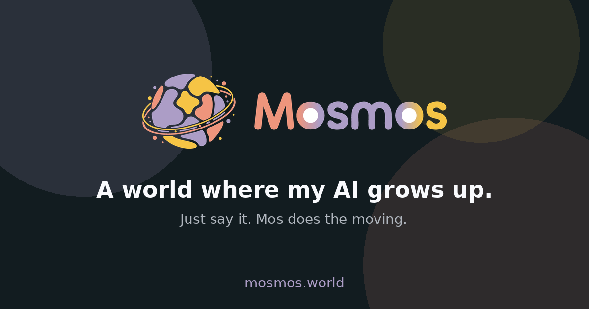

<h1 align="center">Mosmos — Waitlist</h1>

<p align="center">


</p>



> **내 AI가 자라는 세계.** _A world where my AI grows up._

The waitlist landing page for **Mosmos** — a B2A2P (Business to AI Agent to
Prosumer) platform. Users state a goal to their AI avatar **Mos**, which
orchestrates the right **Mon** (execution specialists) to get the work done,
with **Skill** recipes and **Mana** credits powering the ecosystem.

Visitors join the private-beta waitlist; entries are stored in Notion and a
branded welcome email is sent via Resend.

## Tech stack

This page keeps the original waitlist template's stack as its base:

- **Next.js 14** — App Router, React Server / Client components.
- **Notion** — used as the Mosmos waitlist database (CMS).
- **Upstash Redis** — rate limits signups (2 requests / minute / IP).
- **Resend + React Email** — sends the Mosmos welcome email.
- **shadcn/ui · Magic UI · Tailwind CSS** — UI, themed with the Mosmos brand palette.
- **Vercel** — hosting.

## Brand

Pulled from the Mosmos Brand Kit and applied across the page, favicon, OG image
and email:

| Token | Color | Role |
| --- | --- | --- |
| Memory Lilac | `#AC9DC6` | Main / primary accent |
| Hearth Coral | `#EE957C` | Sub |
| Harvest Gold | `#F6C445` | Point |
| Mana Iris | `#8EA2FF` | Support |
| Aether Cyan | `#9BCAD0` | Support |
| Orbit Blue | `#6F96C4` | Support |
| Mono Dark | `#121C20` | Background |
| Mono Light | `#F9FAFD` | Text |

Logo assets live in `public/brand/` and are also exposed as `app/icon.png` and
`app/opengraph-image.png`.

## Setup

### Notion (waitlist database)

Create a Notion database with these properties:

- **Name**: Title
- **Email**: Email

Create an internal integration on the [Notion Integrations page](https://www.notion.so/my-integrations),
share the database with it, then copy the integration secret and the database
ID (`https://www.notion.so/{DATABASE_ID}?v=...`).

### Upstash Redis

Create a free Redis database and copy its `REST URL` and `TOKEN`.

### Resend

Add and verify the `mosmos.world` domain in Resend, then generate an API key.

## Run locally

This project uses `bun`:

```bash
bun install
bun dev          # dev server
bun email        # email preview server
```

Copy `.env.example` to `.env.local` and fill in:

- `NOTION_SECRET`, `NOTION_DB`
- `RESEND_API_KEY`
- `UPSTASH_REDIS_REST_URL`, `UPSTASH_REDIS_REST_TOKEN`
- `NEXT_PUBLIC_SITE_URL` (used for absolute asset URLs in emails)

## Credits

Built on the open-source
[Next.js + Notion waitlist template](https://github.com/lakshaybhushan/nextjs-notion-waitlist-template)
by [lakshaybhushan](https://lakshb.dev), rebranded for Mosmos.
